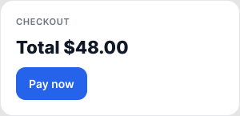

# Strap

<p align="center">
  
</p>

[](https://github.com/YilannDong/strap/actions/workflows/ci.yml)

**An enforcement layer for Claude Code + Figma.**
4 skills that keep AI-generated UI on your Design System rails. Components stay linked, tokens
stay bound, nothing goes off-spec.

**[Live demo →](https://YilannDong.github.io/strap/)** · the no-build component gallery.

Strap is inspired by [claude2figma](https://github.com/senlindesign/claude2figma) but adds a
real teeth: a zero-dependency **validation engine** and a **PostToolUse hook that actually blocks
off-spec writes** — enforcement, not just instructions to the model.

---

## Who it's for

Strap is for you if **an AI agent writes UI in your repo and you have a design system you want it
to respect.** Concretely:

- **Design-system teams / design engineers** tired of catching `#3b82f6` and one-off `padding:
  17px` in PR review — Strap blocks it at write time instead.
- **Front-end teams using Claude Code** (or similar agents) on a codebase with design tokens and a
  component library, who want generated UI to stay on-brand without babysitting every diff.
- **Teams with a Figma → code pipeline** who want tokens and components to stay linked in both
  directions.
- **Solo builders / "vibe coders"** shipping AI-generated apps who want one source of visual truth
  so the product doesn't drift into ten shades of blue.

## Who it's *not* for

Be honest with yourself before adopting it:

- **No design system yet.** If you have no tokens/components, there's nothing to enforce. Start a
  token file first (the `examples/starter` system is a fine seed), *then* add Strap.
- **Not using AI to generate UI.** Strap's edge is the agent-blocking hook. If humans write all
  the CSS and a `stylelint`/`eslint` rule + code review already keep you honest, that may be
  enough — Strap overlaps.
- **Native mobile (Swift/Kotlin) or non-web UI.** The scanner targets web files
  (`css/scss/js/jsx/ts/tsx/vue/svelte`). It won't read Swift or Compose.
- **Creative / bespoke / marketing one-offs** where going off-system *is* the point. Rails are the
  wrong tool for art direction.
- **You want a full token build system.** Strap enforces and does light CSS-var codegen; it is
  not a Style Dictionary replacement for transforming tokens across many platforms. Use both.
- **Backend / CLI / data projects** with no UI surface.

## Why it's different

| | claude2figma | **Strap** |
|---|---|---|
| Guidance | Skill prompts | Skill prompts **+ executable rules** |
| Token compliance | Asked of the model | **Scanned & blocked** (raw hex / rgb / off-scale px / off-system fonts) |
| Components | "use instances" | Registry-backed; **redefining a DS component is blocked** |
| QA | Prompt-level "verify" | `strap check` runs on every Edit/Write and **fails the write on errors** |
| Linkage | — | Code Connect map cached in `.strap/`, kept in sync |
| Artifacts | Token Map / Registry (described) | **Machine-readable** `.strap/tokens.json`, `registry.json`, `code-connect.json` |
| Config | — | `strap.config.json` — per-rule severity (`error`/`warn`/`off`) |

## The 4 skills

- **strap-preflight** — sync Figma → build the local DS cache (Token Map, Component Registry,
  Code Connect map) and verify the rails are live. *Run first.*
- **strap-compose** — library-first UI construction. Reuse registry components as instances;
  Auto Layout; semantic naming; keep Code Connect links.
- **strap-bind** — every color/font/spacing/radius bound to a token; post-write QA blocks
  literals.
- **strap-intake** — turn a screenshot/URL/description into a token-aware Design Brief before
  building, so downstream work is already on-spec.

## How it works

<p align="center">
  
</p>

**In one sentence:** you sync your design system into a local cache (`.strap/`) once, then a
PostToolUse hook runs `strap check` after **every** edit — passing on-spec writes and **blocking**
off-spec ones with the exact line and the token to use, which Claude reads and fixes.

The scanner (`scripts/lib/scan.mjs`) flags: hardcoded hex that duplicates or misses a token,
`rgb()/rgba()` literals, fonts outside the type system, spacing/radius off the scale, and local
re-declaration of a registry component. Each rule's severity (`error` blocks, `warn` advises,
`off` disables) is set in `strap.config.json`.

## Full example: Figma → code

A single value — the brand blue — travels from a Figma Variable to a token to a CSS var, and the
hook keeps the code bound to it:

<p align="center">
  
</p>

1. **Figma** defines `color/blue = #2563EB` (plus `radius/button`, `Inter`).
2. **`strap import`** (or the **strap-preflight** skill) caches it in `.strap/tokens.json`, and
   **`strap tokens`** emits `--blue: #2563EB` into `src/styles/tokens.css`.
3. **Your component** binds to `var(--blue)` — and when someone hardcodes the near-miss `#2D6CF0`,
   the hook **blocks the write**: *“duplicates token "blue" → use `var(--blue)`.”*

The Figma value, the token, and the code can't drift apart — that's the loop.

## Full example: Claude Code → Figma

The loop runs both ways. Strap can push an on-spec component **into** Figma — and it lands as
design-system-bound design (instances + bound Variables), not a detached rectangle with a baked-in
hex:

<p align="center">
   to an instance; the result is a Checkout frame in Figma with the Pay-now fill bound to color/blue" width="100%">
</p>

And here it is **generated live** via the Figma MCP — the actual Figma render, not a mockup:

<p align="center">
  
</p>

- The token set became real **Figma Variables** (`color/blue`, `ink`, `ink3`, `white`, `line`).
- The button's fill is **bound to `color/blue`** — change the Variable and the button follows,
  exactly like `var(--blue)` does in code. (Not a hardcoded `#2563EB`.)
- Strap caches the `Button ↔ Button.tsx` link in `.strap/code-connect.json`. *Publishing to
  Figma's **native** Code Connect needs a Dev/Full seat on an Org/Enterprise plan — Strap's local
  cache works on any plan.*

## Install

**As a drop-in (any project):**
```bash
# copy these into your project root
CLAUDE.md  strap.config.json  .strap/  .claude/  scripts/
node scripts/strap.mjs init     # if you don't already have config + artifacts
```
The hook in `.claude/settings.json` activates automatically in Claude Code.

**As a Claude Code plugin:** this repo ships `.claude-plugin/plugin.json` exposing all 4 skills.

## Quickstart (60 seconds, no install)

```bash
git clone https://github.com/YilannDong/strap && cd strap
node --test test/                  # tests pass on Node 18+
node scripts/strap.mjs audit      # sample library validates clean against the DS
node scripts/strap.mjs tokens     # (re)generate src/styles/tokens.css
```

The repo ships with the open **`examples/starter`** design system already imported, so `audit`
is green out of the box. Then point it at *your* system — see
[Importing an existing design system](#importing-an-existing-design-system).

## How to use it

**Mental model:** Strap is not a tool you *run* all day. It's a guard that sits in your repo and
watches. You set it up once, then build normally — and it stops anything off-spec before it lands.
There are really just three moments:

### ① Set it up (once)

Get the files into your project (drop-in or plugin, above), then point Strap at your design
system:

```bash
node scripts/strap.mjs import private/my-ds   # your tokens + component specs → .strap/
node scripts/strap.mjs tokens                 # → src/styles/tokens.css (the CSS vars to bind to)
```

No design system yet? The repo ships `examples/starter` already imported, so you can try it
immediately and swap in yours later.

### ② Build normally (you do nothing)

Work in Claude Code as usual — just talk. The skills fire by context and the hook enforces on
every edit. A real exchange:

```
You:   "Add a price tag to the product card."
Claude: writes PriceTag.css with  background: #3b82f6
Strap: ⛔ blocked — #3b82f6 is off-spec → use var(--blue)
Claude: rewrites it as  background: var(--blue)   ✅
You:    said nothing. The drift was caught and fixed before you saw it.
```

The four skills cover the rest of the loop:
- *"let's start"* / paste a Figma URL → **strap-preflight** syncs tokens + components.
- *"build a settings page"* → **strap-compose** reuses registry components; **strap-bind** keeps
  values on tokens.
- *share a screenshot/URL* → **strap-intake** maps it onto your tokens instead of pixel-copying.

### ③ Sweep the whole repo (when you want)

```bash
node scripts/strap.mjs audit       # validate everything against the DS
npm test                            # run the rule tests (Node 18+)
```

That's the entire surface: **set up once → build → the hook holds the line → audit on demand.**
Swap design systems with one `strap import` and the whole UI re-skins.

> The automatic blocking in ② needs **Node on your PATH** (`brew install node`) so the hook can run
> locally. Without it, enforcement still runs in CI and via `audit`, just not on every keystroke.

## Token architecture

Strap follows the W3C DTCG / Material-3 model — **primitives → semantic → component**:

- **Primitives** (`tokens.json` `colors`): the raw palette. The validator matches any hardcoded
  hex against these and tells you the token to use instead.
- **Semantic** (optional `tokens.json` `semantic.color`): intent tokens that reference a
  primitive *by name*, never a raw value. When present, the codegen emits
  `--brand-default: var(--blue);` and the validator suggests the **semantic** token over the
  bare primitive — steering you to intent.
- **Component** (`registry.json`): each component + the tokens it consumes, built by `import`
  from your `components.*.json`. This is the library-first layer the skills reuse.

The `examples/starter` system uses a flat **functional** palette (`blue`, `ink`, `line`,
`danger`…) — already intent-named, so it skips the separate semantic tier. Add a `semantic`
block to your tokens when your primitives are pure palette steps (`blue/600`).

## Importing an existing design system

If you already have a token file + component specs (DTCG-style JSON with `{group.key}`
aliases), put them in a folder Strap won't publish (`private/` is gitignored) and point the
importer at it:

```bash
node scripts/strap.mjs import private/my-ds   # -> .strap/tokens.json + registry.json
node scripts/strap.mjs tokens                 # -> src/styles/tokens.css
node scripts/strap.mjs audit
```

`import` flattens colors (incl. nested groups), derives the spacing/radius scales, collects font
families, and builds the component registry from every `components.*.json`. Re-run it whenever
the source changes — the artifacts are generated, not hand-edited. See [examples/](examples/).

`import` flattens colors (incl. nested groups), derives the spacing/radius scales, collects
font families, and builds the **Tier-3 component registry** from every `components.*.json` —
recording each component's source, variants, and the exact tokens it `consumes`. Re-run it
whenever the source changes; the artifacts are generated, not hand-edited.

## Token codegen

`tokens.json` is the source of truth; generate CSS variables your code binds to:

```bash
node scripts/strap.mjs tokens          # writes src/styles/tokens.css
node scripts/strap.mjs tokens --stdout # print instead
```

The generated file is auto-exempted from scanning (it's the one place raw hex/rgba/shadows
legitimately live). Everything else must reference `var(--color-brand-primary)` etc.

## Sample library + live preview

`src/components/` ships token-bound React components (`Button`, `Input`, `Card`, `Badge`) plus
`src/App.tsx`, a screen built the Strap way — reference code that audits 100% clean. Edit any
value to a raw hex and watch the hook bounce it.

`index.html` is a **no-build static gallery** of the same components (CSS only, no bundler). Open
it directly, or serve it with the launch config:

```bash
python3 scripts/preview-server.py 5173     # → http://127.0.0.1:5173
```

## Config

`strap.config.json` controls which files are scanned and the severity of each rule:

```json
{
  "rules": {
    "rawHex": "error", "rawRgb": "error", "rawFont": "error",
    "offScaleSpacing": "warn", "offScaleRadius": "warn", "unlinkedComponent": "error"
  }
}
```

Set any rule to `"off"` to disable, `"warn"` to advise, `"error"` to block.

## Status & roadmap

- ✅ **Enforcement engine** — validate / audit / blocking hook, tested + CI on Node 18/20/22.
- ✅ **Token + component import** from a DTCG-style design system (`strap import`).
- ✅ **Code → Figma** — generated a Checkout frame into Figma live via the MCP, with the token set
  as bound **Figma Variables** (see above).
- ⚠️ **Native Code Connect publish** needs a Dev/Full seat on an Org/Enterprise plan; Strap caches
  the link locally in `.strap/code-connect.json` on any plan.
- The turn-key bidirectional runbook is in **[docs/figma-roundtrip.md](docs/figma-roundtrip.md)**.

## Requirements

- Node 18+ (the engine is pure Node ESM, no dependencies).
- Figma MCP connected in Claude Code (for `strap-preflight` sync).

## License

MIT.
