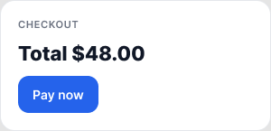

# Strap

<p align="center">
  
</p>

[](https://github.com/YilannDong/strap/actions/workflows/ci.yml)

**An enforcement layer for Claude Code + Figma.**
4 skills + a blocking hook that keep AI-generated UI on your Design System rails — tokens stay
bound, components stay reusable, and off-spec writes are blocked before they land.

**[Live demo →](https://YilannDong.github.io/strap/)** · the no-build component gallery.

Strap is inspired by [claude2figma](https://github.com/senlindesign/claude2figma) but adds a
real teeth: a zero-dependency **validation engine** and a **PostToolUse hook that actually blocks
off-spec writes** — enforcement, not just instructions to the model.

---

## Who it's for

Strap is for you if **an AI agent writes UI in your repo and you have *some* design system — even
just tokens — you want it to respect.** You don't need a finished component library; colors + type
are enough to start. Concretely:

- **Design-system teams / design engineers** tired of catching `#3b82f6` and one-off `padding:
  17px` in PR review — Strap blocks it at write time instead.
- **Front-end teams using Claude Code** (or similar agents) on a codebase with design tokens (a
  component library is a bonus, not a requirement), who want generated UI to stay on-brand without
  babysitting every diff.
- **Teams early in their design system** — you've defined color + type tokens but your components
  are still in flux. Strap enforces the tokens *now* and turns on the component rules later, as you
  register them. (Each rule only activates once you've defined what it checks — see
  [Scenarios](#scenarios).)
- **Teams with a Figma → code pipeline** who want design tokens to flow into code and components
  to stay reusable — with Code Connect linking where their plan allows.
- **Solo builders / "vibe coders"** shipping AI-generated apps who want one source of visual truth
  so the product doesn't drift into ten shades of blue.

## Who it's *not* for

Be honest with yourself before adopting it:

- **Not using AI to generate UI.** Strap's edge is the agent-blocking hook. If humans write all
  the CSS and a `stylelint`/`eslint` rule + code review already keep you honest, that may be
  enough — Strap overlaps.
- **Native mobile (Swift/Kotlin) or non-web UI.** The scanner targets web files
  (`css/scss/js/jsx/ts/tsx/vue/svelte`). It won't read Swift or Compose.
- **Creative / bespoke / marketing one-offs** where going off-system *is* the point. Rails are the
  wrong tool for art direction.
- **You want a full token build system.** Strap enforces and does light CSS-var codegen; it is
  not a Style Dictionary replacement for transforming tokens across many platforms. Use both.
- **Backend / CLI / data projects** with no UI surface.

## Why it's different

| | claude2figma | **Strap** |
|---|---|---|
| Guidance | Skill prompts | Skill prompts **+ executable rules** |
| Token compliance | Asked of the model | **Scanned & blocked** (raw hex / rgb / off-scale px / off-system fonts) |
| Components | "use instances" | Registry-backed; **redefining a DS component is blocked** |
| QA | Prompt-level "verify" | `strap check` runs on every Edit/Write and **fails the write on errors** |
| Linkage | — | Code Connect map cached in `.strap/` (synced on demand via `preflight`/`import`) |
| Artifacts | Token Map / Registry (described) | **Machine-readable** `.strap/tokens.json`, `registry.json`, `code-connect.json` |
| Config | — | `strap.config.json` — per-rule severity (`error`/`warn`/`off`) |

## The 4 skills

- **strap-preflight** — sync Figma → build the local DS cache (Token Map, Component Registry,
  Code Connect map) and verify the rails are live. *Run first.*
- **strap-compose** — library-first UI construction. Reuse registry components as instances;
  Auto Layout; semantic naming; keep Code Connect links.
- **strap-bind** — every color/font/spacing/radius bound to a token; post-write QA blocks
  literals.
- **strap-intake** — turn a screenshot/URL/description into a token-aware Design Brief before
  building, so downstream work is already on-spec.

## How it works

<p align="center">
  
</p>

**In one sentence:** you sync your design system into a local cache (`.strap/`) once, then a
PostToolUse hook runs `strap check` after **every** edit — passing on-spec writes and **blocking**
off-spec ones with the exact line and the token to use, which Claude reads and fixes.

The scanner (`scripts/lib/scan.mjs`) flags: hardcoded hex that duplicates or misses a token,
`rgb()/rgba()` literals, fonts outside the type system, spacing/radius off the scale, and local
re-declaration of a registry component. Each rule's severity (`error` blocks, `warn` advises,
`off` disables) is set in `strap.config.json`.

## Full example: Figma → code

A single value — the brand blue — travels from a Figma Variable to a token to a CSS var, and the
hook keeps the code bound to it:

<p align="center">
  
</p>

1. **Figma** defines `color/blue = #2563EB` (plus `radius/button`, `Inter`).
2. **`strap import`** (or the **strap-preflight** skill) caches it in `.strap/tokens.json`, and
   **`strap tokens`** emits `--blue: #2563EB` into `src/styles/tokens.css`.
3. **Your component** binds to `var(--blue)` — and when someone hardcodes the near-miss `#2D6CF0`,
   the hook **blocks the write**: *“duplicates token "blue" → use `var(--blue)`.”*

The Figma value, the token, and the code can't drift apart — that's the loop.

## Full example: Claude Code → Figma

The loop runs both ways. Strap can push an on-spec component **into** Figma — and it lands as
design-system-bound design (instances + bound Variables), not a detached rectangle with a baked-in
hex:

<p align="center">
   to an instance; the result is a Checkout frame in Figma with the Pay-now fill bound to color/blue" width="100%">
</p>

And here it is **generated live** via the Figma MCP — the actual Figma render, not a mockup:

<p align="center">
  
</p>

- The token set became real **Figma Variables** (`color/blue`, `ink`, `ink3`, `white`, `line`).
- The button's fill is **bound to `color/blue`** — change the Variable and the button follows,
  exactly like `var(--blue)` does in code. (Not a hardcoded `#2563EB`.)
- Strap caches the `Button ↔ Button.tsx` link in `.strap/code-connect.json`. *Publishing to
  Figma's **native** Code Connect needs a Dev/Full seat on an Org/Enterprise plan — Strap's local
  cache works on any plan.*

## Install

**As a drop-in (any project):**
```bash
# copy these into your project root
CLAUDE.md  strap.config.json  .strap/  .claude/  scripts/
node scripts/strap.mjs init     # if you don't already have config + artifacts
```
The hook in `.claude/settings.json` activates automatically in Claude Code.

**As a Claude Code plugin:** this repo ships `.claude-plugin/plugin.json` exposing all 4 skills.

## Quickstart (60 seconds, no install)

```bash
git clone https://github.com/YilannDong/strap && cd strap
npm test                           # unit + CLI tests (Node 18+, zero deps)
node scripts/strap.mjs audit      # sample library validates clean against the DS
node scripts/strap.mjs tokens     # (re)generate src/styles/tokens.css
```

The repo ships with the open **`examples/starter`** design system already imported, so `audit`
is green out of the box. Then point it at *your* system — see
[Importing an existing design system](#importing-an-existing-design-system).

## How to use it

**Mental model:** Strap is not a tool you *run* all day. It's a guard that sits in your repo and
watches. You set it up once, then build normally — and it stops anything off-spec before it lands.
There are really just three moments:

### ① Set it up (once)

Get the files into your project (drop-in or plugin, above), then point Strap at your design
system:

```bash
node scripts/strap.mjs import private/my-ds   # your tokens + component specs → .strap/
node scripts/strap.mjs tokens                 # → src/styles/tokens.css (the CSS vars to bind to)
```

No design system yet? The repo ships `examples/starter` already imported, so you can try it
immediately and swap in yours later.

### ② Build normally (you do nothing)

Work in Claude Code as usual — just talk. The skills fire by context and the hook enforces on
every edit. A real exchange:

```
You:   "Add a price tag to the product card."
Claude: writes PriceTag.css with  background: #3b82f6
Strap: ⛔ blocked — #3b82f6 is off-spec → use var(--blue)
Claude: rewrites it as  background: var(--blue)   ✅
You:    said nothing. The drift was caught and fixed before you saw it.
```

The four skills cover the rest of the loop:
- *"let's start"* / paste a Figma URL → **strap-preflight** syncs tokens + components.
- *"build a settings page"* → **strap-compose** reuses registry components; **strap-bind** keeps
  values on tokens.
- *share a screenshot/URL* → **strap-intake** maps it onto your tokens instead of pixel-copying.

### ③ Sweep the whole repo (when you want)

```bash
node scripts/strap.mjs audit       # validate everything against the DS
npm test                            # run the rule tests (Node 18+)
```

That's the entire surface: **set up once → build → the hook holds the line → audit on demand.**
Swap design systems with one `strap import` and the whole UI re-skins.

> The automatic blocking in ② needs **Node on your PATH** (`brew install node`) so the hook can run
> locally. Without it, enforcement still runs in CI and via `audit`, just not on every keystroke.

## Scenarios

How Strap behaves in the situations people actually worry about.

### "I have tokens, but my components are still in flux"

You're a fit — this is a great way to start. **Each rule only activates once you've defined what
it checks**, so a partial design system enforces partially, with no false positives:

| You've defined | Rule | Behavior |
|---|---|---|
| Colors | `rawHex` / `rawRgb` | **active** — hardcoded colors blocked |
| Typography | `rawFont` | **active** — off-system fonts blocked |
| *(no spacing/radius scale yet)* | `offScaleSpacing` / `offScaleRadius` | **dormant** until you add the scale |
| *(empty registry)* | `unlinkedComponent` | **dormant** until you register components |

So with **colors + type defined and components still being explored**, you get full color/font
enforcement on day one, while the component layer stays quiet until you start registering. Strap
enforces *what you've decided* and grows with the system — it never demands a finished one.

### "I want to add a new component"

Strap **doesn't block new components** — they're explicit decisions, not forbidden moves.

1. Build it as usual. The hook still enforces its values are tokens (`var(--blue)`, the spacing
   scale, etc.) — a new component can't smuggle in raw hex.
2. **strap-compose** surfaces it as a decision rather than inventing it silently: *"this needs a
   new DS component — approve?"*
3. Once approved, it's **added to the registry** (so the next person reuses it instead of
   re-rolling a second copy) and **linked** to its Figma master via Code Connect.

→ The new component becomes a first-class, reusable part of the system — cleanly.

### "A component got created by accident"

Nothing bad happens, and **it does not get auto-added to anything.**

- **Strap never auto-registers.** The only things that write `.strap/registry.json` are explicit
  syncs — `strap import` / `strap-preflight` — from your source of truth (the Figma published
  library). The scanner only *reads* the registry; it can't grow it.
- The stray component is just **ordinary code**: still token-checked, but never promoted into the
  design system. It isn't falsely flagged either — the `unlinkedComponent` rule only fires when
  you re-declare a component that *already* exists in the registry.
- The registry is **generated, not accreted.** Re-running a sync rebuilds it from source, so junk
  can't slowly pile up — the registry is always a mirror of your real DS, not a log of everything
  ever written.

→ Accidents stay as un-promoted code. The system only grows when you say so.

## Token architecture

Strap follows the W3C DTCG / Material-3 model — **primitives → semantic → component**:

- **Primitives** (`tokens.json` `colors`): the raw palette. The validator matches any hardcoded
  hex against these and tells you the token to use instead.
- **Semantic** (optional `tokens.json` `semantic.color`): intent tokens that reference a
  primitive *by name*, never a raw value. When present, the codegen emits
  `--brand-default: var(--blue);` and the validator suggests the **semantic** token over the
  bare primitive — steering you to intent.
- **Component** (`registry.json`): each component + the tokens it consumes, built by `import`
  from your `components.*.json`. This is the library-first layer the skills reuse.

The `examples/starter` system uses a flat **functional** palette (`blue`, `ink`, `line`,
`danger`…) — already intent-named, so it skips the separate semantic tier. Add a `semantic`
block to your tokens when your primitives are pure palette steps (`blue/600`).

## Importing an existing design system

If you already have a token file + component specs (DTCG-style JSON with `{group.key}`
aliases), put them in a folder Strap won't publish (`private/` is gitignored) and point the
importer at it:

```bash
node scripts/strap.mjs import private/my-ds   # -> .strap/tokens.json + registry.json
node scripts/strap.mjs tokens                 # -> src/styles/tokens.css
node scripts/strap.mjs audit
```

`import` flattens colors (incl. nested groups), derives the spacing/radius scales, collects font
families, and builds the component registry from every `components.*.json`. Re-run it whenever
the source changes — the artifacts are generated, not hand-edited. See [examples/](examples/).

`import` flattens colors (incl. nested groups), derives the spacing/radius scales, collects
font families, and builds the **Tier-3 component registry** from every `components.*.json` —
recording each component's source, variants, and the exact tokens it `consumes`. Re-run it
whenever the source changes; the artifacts are generated, not hand-edited.

## Token codegen

`tokens.json` is the source of truth; generate CSS variables your code binds to:

```bash
node scripts/strap.mjs tokens          # writes src/styles/tokens.css
node scripts/strap.mjs tokens --stdout # print instead
```

The generated file is auto-exempted from scanning (it's the one place raw hex/rgba/shadows
legitimately live). Everything else must reference `var(--color-brand-primary)` etc.

## Sample library + live preview

`src/components/` ships token-bound React components (`Button`, `Input`, `Card`, `Badge`) plus
`src/App.tsx`, a screen built the Strap way — reference code that audits 100% clean. Edit any
value to a raw hex and watch the hook bounce it.

`index.html` is a **no-build static gallery** of the same components (CSS only, no bundler). Open
it directly, or serve it with the launch config:

```bash
python3 scripts/preview-server.py 5173     # → http://127.0.0.1:5173
```

## Config

`strap.config.json` controls which files are scanned and the severity of each rule:

```json
{
  "rules": {
    "rawHex": "error", "rawRgb": "error", "rawFont": "error",
    "offScaleSpacing": "warn", "offScaleRadius": "warn", "unlinkedComponent": "error",
    "duplicateComponent": "warn"
  }
}
```

Set any rule to `"off"` to disable, `"warn"` to advise, `"error"` to block.

### Duplicate radar (`duplicateComponent`)

`unlinkedComponent` only catches a component re-declared by **name**. The duplicate radar catches the
harder case: something that *is* a design-system component but was never named one — a `.panel` that
uses the exact same tokens as your `Card`. It fingerprints the **token footprint** and, when it reuses
≥60% (and ≥3) of a registry component's `consumes` tokens without naming it, warns:

```
.surface-box  warn  CSS rule ".surface-box" reuses 4/4 of the "card" component's tokens
              (color.line, color.white, radius.card, …). If this is a card,
              use the DS component instead of rebuilding it.  duplicateComponent
```

It scans **four surfaces** — because look-alikes hide in more than CSS:

| Surface | Example it catches |
|---|---|
| CSS / SCSS rule | `.panel { background: var(--white); … }` |
| styled-components / `css\`\`` | ``const Panel = styled.div`background: var(--white); …` `` |
| inline `style={{}}` | `<div style={{ background: 'var(--white)', … }}>` |
| `className` / Tailwind | `<div className="bg-white border-line rounded-card shadow-md">` |

Tailwind utilities are mapped to tokens by leaf name (`rounded-card` → `radius.card`) and **gated to
tokens your DS actually defines**, so Tailwind's own defaults (`shadow-lg`…) don't create noise;
arbitrary values (`bg-[var(--white)]`) are read directly. Component **instances** (`<Card>`,
`styled(Card)`) and anything named after the component (a `.card` selector, a `card` class) are
skipped — that's intentional usage.

It's **advisory (`warn`-only) by design** — semantic similarity is fuzzy, so it never blocks a write;
it keeps the deterministic core (off-spec values, named re-declarations) trustworthy while surfacing
look-alikes for a human to judge. Set it to `"off"` to silence, or `"error"` to block.

> **Honest limit:** the JSX/Tailwind passes are **regex-based, not a full AST** — they read each
> element's own `style`/`className`/`styled` block, not styles inherited from ancestor selectors or
> composed via helper functions. It's a conservative net (favoring few false positives over total
> recall); per-element AST-grade fingerprinting is the future "weeks" version.

### Figma duplicate radar (`strap figma-audit`)

The same idea, applied to the **Figma canvas** — because look-alikes are born there too. Strap has no
runtime inside Figma, so it drives the **Figma MCP**: the **strap-figma-audit** skill walks the file
(`get_metadata`), enriches each frame with its bound-variable token footprint (`get_design_context`),
and writes `.strap/figma-frames.json`. The deterministic engine then audits that snapshot offline:

```bash
node scripts/strap.mjs figma-audit          # reads .strap/figma-frames.json
```

Two advisory (`warn`) rules:

- **`figmaDuplicateComponent`** — a raw frame whose token footprint matches a registry component but
  that was never made an **instance** (instances/masters are skipped, like the CSS name-skip):

  ```
  warn  Home · Panel (10:1)  Frame "Panel" reuses 4/4 of the "card" component's tokens
        (color.line, color.white, radius.card, …) but is a raw frame, not an instance.
        Replace it with the library component.  figmaDuplicateComponent
  ```

- **`figmaDuplicateFrame`** — clusters of near-identical raw frames (same structure + tokens) that
  should be one component: *"2 near-identical frames … componentize to dedupe."*

**Honest limits:** it's advisory + heuristic (same trade-off as the code radar); instance detection
depends on what `get_design_context` exposes (ambiguous nodes are treated as raw frames, so it can
over-flag); and it enriches at most ~60 frames per run to respect Figma rate limits, logging anything
skipped. For continuous in-canvas linting, dedicated Figma plugins (Design Lint, etc.) complement it.

### Component lifecycle (`strap evaluate`)

The radars ask *"is this a duplicate right now?"* — `evaluate` asks *"what should the component
**library** become?"* After a sprint, run it over what shipped (code + an optional Figma snapshot);
it proposes two lifecycle moves and leaves the decision to you:

```bash
node scripts/strap.mjs evaluate              # code only
node scripts/strap.mjs evaluate --figma .strap/figma-frames.json   # + Figma frames
```

- **Promotion** — a token-footprint pattern that recurs **≥ `promoteMin`** times but isn't a
  component yet: *"8× {color.line, color.white, radius.card, shadow.md} — promote to a component?"*
  (Patterns that already match a registry component are skipped — that's the duplicate radar's job.)
- **Retirement** — a registry component that is **barely used** (≤ `retireMax` total usages: code
  `<Component>` + Figma instances), annotated with git-dated recency and a rolling "uses in the last
  N months" count to inform the call: *"`badge` — 1 use — used this month, 2 in last 6mo — retire?"*
  (Low recent *activity* alone never triggers it — a stable, well-used component is not a candidate.)

It's **advisory and never fails a build** — Strap proposes, you decide (same model as every radar).
Thresholds live under `evaluate` in `strap.config.json` (`promoteMin` 3, `retireMax` 1,
`minFootprint` 3, `windowMonths` 6).

**Runs itself, after each sprint.** `.github/workflows/evaluate.yml` runs it automatically — on every
PR scoped to *what that PR ships* (`--since` the base branch), plus a weekly full sweep. On a PR it
posts the proposals as a **single sticky comment** (updated in place, never piled up); scheduled runs
go to the job summary. So the noticing happens on its own, right where you're reviewing; you just read
and decide. Flags: `--since <ref>` scopes the search for *new* patterns to what changed (retirement
still measures the whole codebase); `--md` emits Markdown for the comment / summary.

**How the temporal signals work:** Strap dates last use with `git log -1 -G'<Component'` (last commit
whose diff touched a usage) and counts recent activity with `git log --since -G'<Component'` (the
rolling `windowMonths` window). Git is the one impure corner
([scripts/lib/git.mjs](scripts/lib/git.mjs)); the analysis engine stays pure — the dates and counts
are passed in. Outside a git repo, both are skipped and it falls back to counts.

**Design note — usage, not activity:** retirement triggers on **low usage only**, never on low recent
activity. A `Button` used in 50 places but untouched for a year is *stable*, not dead — flagging it
would be a false positive. Recency and the rolling window are **annotations** that help you judge the
already-low-usage candidates, not extra triggers.

**Honest limits:** the window counts *usage-touching commits*, a proxy for "times used recently";
retirement usage is best-effort (resolves a component's code name via Code Connect, else PascalCase);
cross-surface clustering needs consistent token-leaf naming (a CSS `--warn-tint` and a Figma
`warnTint` won't merge). Posting the report as a PR *comment* and acting on your decision (scaffold /
remove) are still deferred.

## Status & roadmap

- ✅ **Enforcement engine** — validate / audit / blocking hook, tested + CI on Node 18/20/22.
- ✅ **Token + component import** from a DTCG-style design system (`strap import`).
- ✅ **Code → Figma** — generated a Checkout frame into Figma live via the MCP, with the token set
  as bound **Figma Variables** (see above).
- ⚠️ **Native Code Connect publish** needs a Dev/Full seat on an Org/Enterprise plan; Strap caches
  the link locally in `.strap/code-connect.json` on any plan.
- ✅ **Duplicate radar (code)** — a heuristic, *advisory* (`warn`-only) rule that flags a hand-written
  look-alike whose token footprint matches an existing registry component but that was never named one
  (the `<div>`-that's-really-a-`Card` case named re-declaration detection misses). Scans **CSS,
  styled-components, inline `style`, and `className`/Tailwind**. Stays advisory to keep the
  deterministic core trustworthy — see **[Duplicate radar](#duplicate-radar-duplicatecomponent)**.
- ✅ **Figma duplicate radar** — `strap figma-audit` + the **strap-figma-audit** skill: walks the
  canvas via the Figma MCP and flags raw frames that are really a library component, plus clusters of
  near-identical frames. Advisory, MCP-driven (no Figma plugin) — see
  **[Figma duplicate radar](#figma-duplicate-radar-strap-figma-audit)**.
- ✅ **Component lifecycle (`strap evaluate`)** — advisory radar that proposes **promotions**
  (recurring patterns → components) and **retirements** (barely-used **or stale** components, dated
  from git history). Strap surfaces, the human decides — see
  **[Component lifecycle](#component-lifecycle-strap-evaluate)**.
- The turn-key bidirectional runbook is in **[docs/figma-roundtrip.md](docs/figma-roundtrip.md)**.

**Exploring (not built yet):**

- 🔭 **Lifecycle — the last step** — CI auto-trigger, PR-scoped scan, rolling-window recency, and a
  sticky PR comment all ship now. The only piece left is **acting on an approved proposal** (scaffold
  the promoted component / remove the retired one) — the one step that crosses from *propose* into
  *act*, and so wants a deliberate design (it changes the human-stays-editor division of labor).
- 🔭 **Tighter Figma ↔ code round-trips** — richer bidirectional sync (Code Connect publish on any
  plan, continuous drift detection between canvas and code).
- 🔭 **Deeper Figma dedup** — the current radar is a conservative first pass; per-element AST-grade
  fingerprinting and false-positive tuning are the long pole. Dedicated Figma lint plugins
  (Design Lint, etc.) complement it for continuous in-canvas checks.

## Requirements

- Node 18+ (the engine is pure Node ESM, **zero runtime dependencies**).
- Figma MCP connected in Claude Code (only for the `strap-preflight` sync / Figma features).

## Free & self-hosted

Strap costs **nothing** to run, adopt, or maintain:

- **Runs entirely on your machine.** The engine is a zero-dependency Node script — no server, no
  telemetry, nothing phones home. Your code and tokens never leave your repo.
- **No paid services, no backend to host.** Each user brings their own Figma + Claude Code; Strap
  never proxies or bills anything.
- **Free on GitHub.** CI and the live-demo Pages deploy run on the free tier for **public** repos
  (Actions minutes are unlimited for public repositories); the workflows use no secrets.
- **MIT licensed** — fork it, ship it, change it. No attribution gymnastics.

## License

MIT — see [LICENSE](LICENSE). Free for any use, including commercial.
